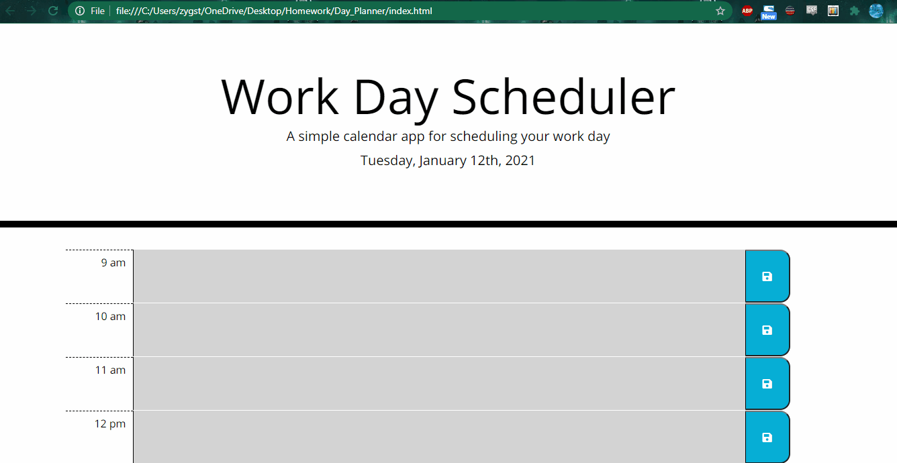

# Day Planner - Homework 5

A simple application for planning your day by the hour.

# Purpose of the Repository

This fifth homework assignment tasked the coder with creating a functional day planner for the current day of the week. It was designed to challenge the coder to utilize jQuery to store information from the planner page in local storage and keep information placed by the user on the page after the page is refreshed. The assignment also called for usage of a third-party API, called 'moment.js' to be implemented in the day planner to set the current day of the week. 

# Description of Repository 

The repository creates a functioning day planner. The planner consists of rows designating the hours of the current 'work' day, from 9 am to 6 pm. On loading the page, it retrieves the current month, current day of the month, current day of the week, and current year will, which is displayed just above the the calendar. A third-party API named 'moment.js' is used to retrieve this current date. 

In the body of the page, an array of rows displays the hours for the current day. Each of these rows has text to its left designating which hour of the day it is. To the right of this rests a textarea element in which the user can input any relevant data related to that hour (e.g. make coffee at 9am, eat lunch at 12pm, etc.). A save button sits to the right of textarea, and once clicked, it will save whatever text was placed in the textarea to local storage. The save button only saves data for the specific row it corresponds to. 

The user can place multiple inputs in different rows and save each of them using the appropriate save button. The local storage then will become populated with the text placed by the user. A new key is made for each hour (e.g. the 9am row's key is "hour 9"). If the user refreshes the page, the input they have placed in the textareas will remain there until edited or removed by the user. 

Another feature of this day planner is color-coordination. Any hour-rows that are BEFORE the current hour (i.e. hours in the past) will have a slate gray background-color to them. The present hour will be coded a nice salmon color, while future hours will have a soothing pastel green hue to them. This functionality required using the moment.js API to compare the current hour on load with the values of each row. 

# Files in Repository

This repository was sort of unique in that style.css file was provided for the coder and needed only a few alterations. This style.css file I moved into the 'css' folder I created inside of the 'Assets' folder. 

Also in the Assets folder one can find the js folder housing the script.js file, in which lies my jQuery code for the assignment, as well as the provided gif image for how the day planner is supposed to look. I think mine came pretty close. I created a gif of my own planner and placed it inside the Assets, too. 

The index.html file is outside of any folder branches, along with the MyREADME file. 

# Links and Gif

GitHub Clone:

https://github.com/ElderBass/Day-Planner.git

GitPages Link:

https://elderbass.github.io/Day-Planner/

Demo of Planner:

